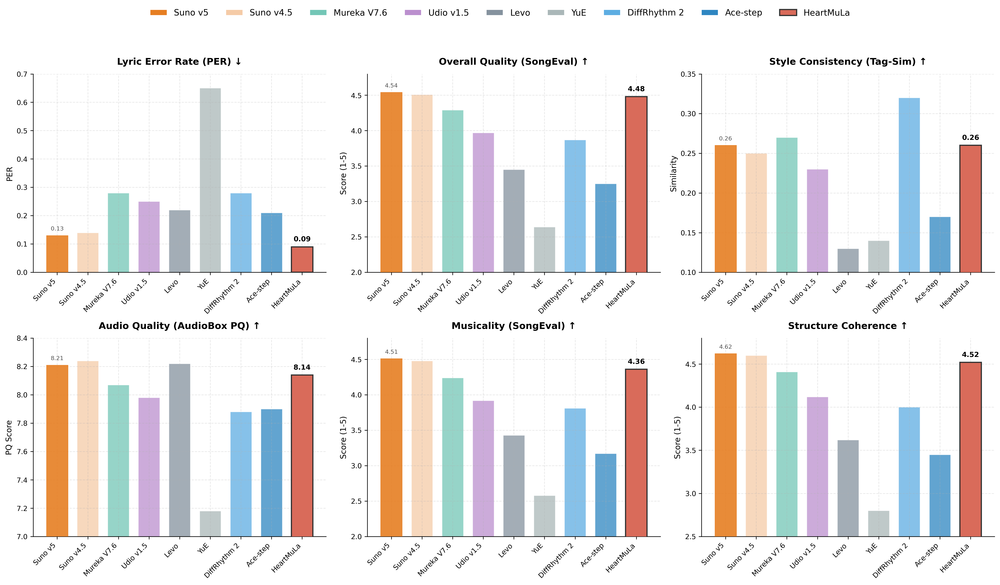

<p align="center">
    <picture>
        <source srcset="./assets/logo.png" media="(prefers-color-scheme: dark)">
        
    </picture>
    
</p>

<p align="center">
    <a href="https://heartmula.github.io/">Demo 🎶</a> &nbsp;|&nbsp; 📑 <a href="https://arxiv.org/pdf/2601.10547">Paper</a>
    <br>
    <a href="https://huggingface.co/HeartMuLa/HeartMuLa-oss-3B">HeartMuLa-oss-3B 🤗</a> &nbsp;|&nbsp; <a href="https://modelscope.cn/models/HeartMuLa/HeartMuLa-oss-3B">HeartMuLa-oss-3B <picture>
        <source srcset="./assets/badge.svg" media="(prefers-color-scheme: dark)">
        
    </picture></a>
    <br>
    <a href="https://huggingface.co/HeartMuLa/HeartMuLa-RL-oss-3B-20260123"> HeartMuLa-RL-oss-3B-20260123 🤗</a> &nbsp;|&nbsp; <a href="https://modelscope.cn/models/HeartMuLa/HeartMuLa-RL-oss-3B-20260123">HeartMuLa-RL-oss-3B-20260123 <picture>
        <source srcset="./assets/badge.svg" media="(prefers-color-scheme: dark)">
        
    </picture></a>
    
</p>

---
# HeartMuLa: A Family of Open Sourced Music Foundation Models

HeartMuLa is a family of open sourced music foundation models including: 
1. HeartMuLa: a music language model that generates music conditioned on lyrics and tags with multilingual support including but not limited to English, Chinese, Japanese, Korean and Spanish.
2. HeartCodec: a 12.5 hz music codec with high reconstruction fidelity;
3. HeartTranscriptor: a whisper-based model specifically tuned for lyrics transcription; Check [this page](./examples/README.md) for its usage.
4. HeartCLAP: an audio–text alignment model that establishes a unified embedding space for music descriptions and cross-modal retrieval.
---


Below shows the experiment result of our oss-3B version compared with other baselines.
<p align="center">
    <picture>
        <source srcset="./assets/exp.png" media="(prefers-color-scheme: dark)">
        
    </picture>
    
</p>

---

## 🔥 Highlight

Our latest internal version of HeartMuLa-7B achieves **comparable performance with Suno** in terms of musicality, fidelity and controllability. If you are interested, welcome to reach us out via heartmula.ai@gmail.com

## 📰 News
Join on Discord! [](https://discord.gg/BKXF5FgH)

- ⚖️ **03 Feb. 2026**
  We have released our [HeartMuLa-Benchmark](https://modelscope.cn/datasets/HeartMuLa/HeartMuLa-Benchmark) as introduced in our [paper](https://arxiv.org/pdf/2601.10547). This benchmark comprises heterogeneous AI-generated lyrics and tags across diverse languages and genres, providing a rigorous and fair evaluation framework.
  
- 🚀 **23 Jan. 2026**

    By leveraging Reinforcement Learning, we have continuously refined our model and are proud to officially release **HeartMuLa-RL-oss-3B-20260123**. This version is designed to achieve more precise control over styles and tags. Simultaneously, we are launching **HeartCodec-oss-20260123**, which optimizes audio decoding quality.

- 🫶 **20 Jan. 2026** 
    
    [Benji](https://github.com/benjiyaya) has created a wonderful [ComfyUI custom node](https://github.com/benjiyaya/HeartMuLa_ComfyUI) for HeartMuLa. Thanks Benji!
- ⚖️ **20 Jan. 2026** 

    License update: We update the license of this repo and all related model weights to **Apache 2.0**.
- 🚀 **14 Jan. 2026**  
    The official release of **HeartTranscriptor-oss** and the first **HeartMuLa-oss-3B** version along with our **HeartCodec-oss**.

---
## 🧭 TODOs

- ⏳ Release scripts for inference acceleration and streaming inference. The current inference speed is around RTF $\approx 1.0$.
- ⏳ Support **reference audio conditioning**, **fine-grained controllable music generation**, **hot song generation**.
- ⏳ Release the **HeartMuLa-oss-7B** version.
- ✅ Release inference code and pretrained checkpoints of  
  **HeartCodec-oss, HeartMuLa-oss-3B, and HeartTranscriptor-oss**.

---

## 🛠️ Local Deployment

### ⚙️ Environment Setup

We recommend using `python=3.10` for local deployment.

Clone this repo and install locally.

```
git clone https://github.com/HeartMuLa/heartlib.git
cd heartlib
pip install -e .
```

Download our pretrained checkpoints from huggingface or modelscope using the following command:

```
# if you are using huggingface
hf download --local-dir './ckpt' 'HeartMuLa/HeartMuLaGen'

## To use version released on 20260123 (recommended)
hf download --local-dir './ckpt/HeartMuLa-oss-3B' 'HeartMuLa/HeartMuLa-RL-oss-3B-20260123'
hf download --local-dir './ckpt/HeartCodec-oss' HeartMuLa/HeartCodec-oss-20260123

## To use oss-3B version
hf download --local-dir './ckpt/HeartMuLa-oss-3B' 'HeartMuLa/HeartMuLa-oss-3B'
hf download --local-dir './ckpt/HeartCodec-oss' 'HeartMuLa/HeartCodec-oss'

# if you are using modelscope
modelscope download --model 'HeartMuLa/HeartMuLaGen' --local_dir './ckpt'

## To use version released on 20260123 (recommended)
modelscope download --model 'HeartMuLa/HeartMuLa-RL-oss-3B-20260123' --local_dir './ckpt/HeartMuLa-oss-3B'
modelscope download --model 'HeartMuLa/HeartCodec-oss-20260123' --local_dir './ckpt/HeartCodec-oss'

## To use oss-3B version
modelscope download --model 'HeartMuLa/HeartMuLa-oss-3B' --local_dir './ckpt/HeartMuLa-oss-3B'
modelscope download --model 'HeartMuLa/HeartCodec-oss' --local_dir './ckpt/HeartCodec-oss'
```

After downloading, the `./ckpt` subfolder should structure like this:
```
./ckpt/
├── HeartCodec-oss/
├── HeartMuLa-oss-3B/
├── gen_config.json
└── tokenizer.json
```


### ▶️ Example Usage

To generate music, run:

```
python ./examples/run_music_generation.py --model_path=./ckpt --version="3B"
```

By default this command will generate a piece of music conditioned on lyrics and tags provided in `./assets` folder. The output music will be saved at `./assets/output.mp3`.

#### FAQs

1. How to specify lyrics and tags?

    The model will load lyrics from the txt file `--lyrics` link to (by default `./assets/lyrics.txt`). If you would like to use your own lyrics, just modify the content in `./assets/lyrics.txt`. If you would like to save your lyrics to another path, e.g. `my_awesome_lyrics.txt`, remember to input arguments `--lyrics my_awesome_lyrics.txt`.

    For tags it's basically the same.

2. CUDA out of memory?

    If you have multi-GPUs (e.g. 2 4090s), we recommend placing the params of HeartMuLa and HeartCodec separately on different devices. You can do it by typing `--mula_device cuda:0 --codec_device cuda:1`

    If you are running on a single GPU, use `--lazy_load true` so that modules will be loaded on demand and deleted once inference completed to save GPU memory.

All parameters:

- `--model_path` (required): Path to the pretrained model checkpoint
- `--lyrics`: Path to lyrics file (default: `./assets/lyrics.txt`)
- `--tags`: Path to tags file (default: `./assets/tags.txt`)
- `--save_path`: Output audio file path (default: `./assets/output.mp3`)
- `--max_audio_length_ms`: Maximum audio length in milliseconds (default: 240000)
- `--topk`: Top-k sampling parameter for generation (default: 50)
- `--temperature`: Sampling temperature for generation (default: 1.0)
- `--cfg_scale`: Classifier-free guidance scale (default: 1.5)
- `--version`: The version of HeartMuLa, choose between [`3B`, `7B`]. (default: `3B`) # `7B` version not released yet.
- `--mula_device/--codec_device`: The device where params will be placed. Both are set to `cuda` by default. You can use `--mula_device cuda:0 --codec_device cuda:1` to explicitly place different modules to different devices.
- `--mula_dtype/--codec_dtype`: Inference dtype. By default is `bf16` for HeartMuLa and `fp32` for HeartCodec. Setting `bf16` for HeartCodec may result in the degradation of audio quality.
- `--lazy_load`: Whether or not to use lazy loading (default: false). If turned on, modules will be loaded on demand to save GPU usage. 
Recommended format of lyrics and tags:
```txt
[Intro]

[Verse]
The sun creeps in across the floor
I hear the traffic outside the door
The coffee pot begins to hiss
It is another morning just like this

[Prechorus]
The world keeps spinning round and round
Feet are planted on the ground
I find my rhythm in the sound

[Chorus]
Every day the light returns
Every day the fire burns
We keep on walking down this street
Moving to the same steady beat
It is the ordinary magic that we meet

[Verse]
The hours tick deeply into noon
Chasing shadows,chasing the moon
Work is done and the lights go low
Watching the city start to glow

[Bridge]
It is not always easy,not always bright
Sometimes we wrestle with the night
But we make it to the morning light

[Chorus]
Every day the light returns
Every day the fire burns
We keep on walking down this street
Moving to the same steady beat

[Outro]
Just another day
Every single day
```

Regarding tags, check this [issue](https://github.com/HeartMuLa/heartlib/issues/17) for reference.
Our different tags are comma-separated without spaces as illustrated below:
```txt
piano,happy,wedding,synthesizer,romantic
```

---


## ⚖️ License

This repository is licensed under the Apache 2.0 License.

---

## 📚 Citation

```
@misc{yang2026heartmulafamilyopensourced,
      title={HeartMuLa: A Family of Open Sourced Music Foundation Models}, 
      author={Dongchao Yang and Yuxin Xie and Yuguo Yin and Zheyu Wang and Xiaoyu Yi and Gongxi Zhu and Xiaolong Weng and Zihan Xiong and Yingzhe Ma and Dading Cong and Jingliang Liu and Zihang Huang and Jinghan Ru and Rongjie Huang and Haoran Wan and Peixu Wang and Kuoxi Yu and Helin Wang and Liming Liang and Xianwei Zhuang and Yuanyuan Wang and Haohan Guo and Junjie Cao and Zeqian Ju and Songxiang Liu and Yuewen Cao and Heming Weng and Yuexian Zou},
      year={2026},
      eprint={2601.10547},
      archivePrefix={arXiv},
      primaryClass={cs.SD},
      url={https://arxiv.org/abs/2601.10547}, 
}
```

## 📬 Contact
If you are interested in HeartMuLa, feel free to reach us at heartmula.ai@gmail.com

Welcome to join us through [discord](https://discord.gg/BKXF5FgH) or Wechat group.

Scan the QR code on the left to join our Wechat group. If it expires, feel free to raise an issue to remind us of updating. 

If the number of group members exceeds 200, joining the group via directly scanning the QR code is restricted by WeChat. In this case, scan our team member's QR code on the right and send a request writing **HeartMuLa Group Invite**. We will invite you into the group manually.
<p align="center">
    <picture>
        <source srcset="./assets/group_wx.jpeg" media="(prefers-color-scheme: dark)">
        
    </picture>
    <picture>
        <source srcset="./assets/lead_wx.jpeg" media="(prefers-color-scheme: dark)">
        
    </picture>
</p>
